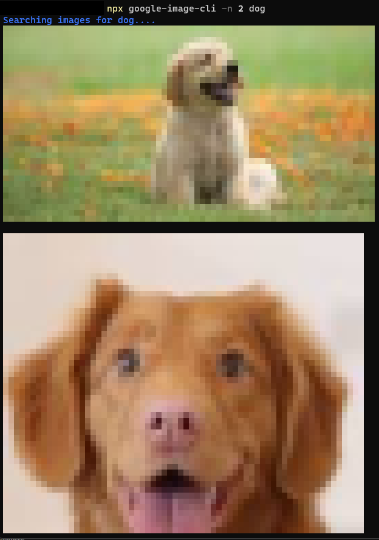

# google-image-cli

google-image-cli is a cli toolkit to search using google and show up to 20 images to cli.

Using [terminal-image](https://www.npmjs.com/package/terminal-image) to display image to terminal.

*In iTerm, the image will be [displayed in full resolution](screenshot-iterm.jpg), since iTerm has [special image support](https://www.iterm2.com/documentation-images.html).*

## Installation
Install 
```npm
npm i -g google-image-cli
```


Run with npx

```npm
npx google-image-cli -n number text-to-search
```

`-n` : number of images (max 20 images)

## Example
Search 2 pics of dog.
```bash
  npx google-image-cli -n 2 dog
```



Search cat image.
```bash
  npx google-image-cli cat
```


## Contributing

All contributions are accepted as a PR.

* You can file issues by submitting a PR.
* Implement new feature by submitting a PR.
* Improve documentation by submitting PR.
You are welcome to improve this project! It would help me so much!
## Support

For support, email downy1229@gmail.com!